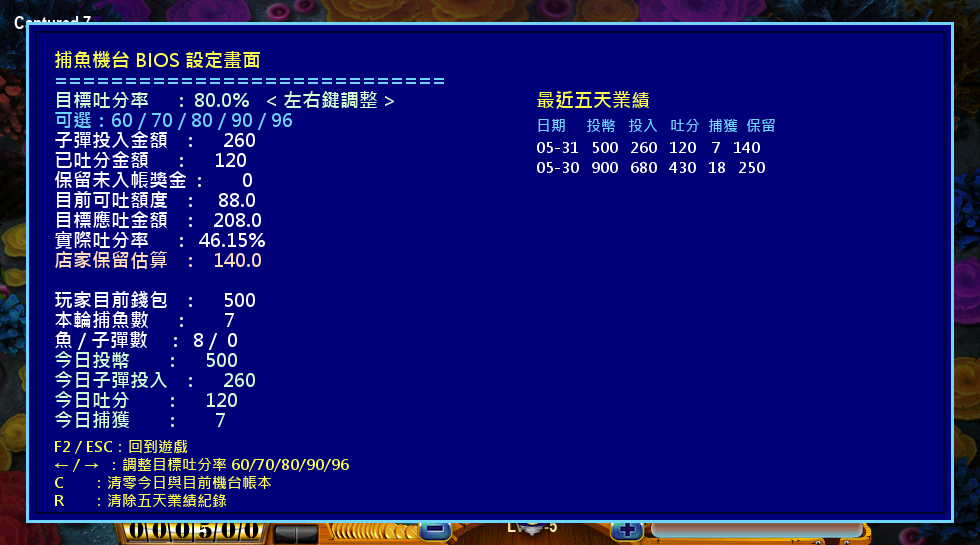
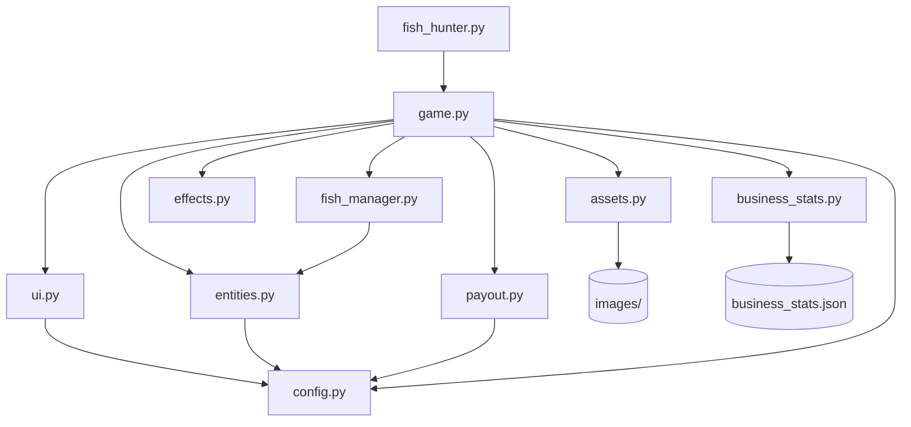

# Fish Hunter Python

我看到有人做了一台捕魚類型的賭博機台，覺得它的玩法、機率控制和機台帳務邏輯都很有趣，所以依照這個方向用 Python/Pygame 重寫了一個可執行版本。這個專案不只做畫面和射擊手感，也加入了魚種倍率、命中機率、目標吐分率、營業統計和機台設定畫面，方便觀察一台捕魚機台背後大概會需要哪些控制邏輯。

I saw a fish-shooting gambling machine project and found its gameplay, probability control, and machine accounting logic interesting, so I rebuilt a playable version in Python/Pygame. This project focuses not only on the shooting experience, but also on fish reward multipliers, capture probability, target payout rate, business statistics, and a machine setup screen to show how this kind of arcade-style machine can be tuned.


## 設定畫面 / Settings Screen



## 功能特色 / Features

- 使用 Python/Pygame 製作捕魚射擊玩法
- Uses Python/Pygame for fish-shooting gameplay
- 保留本機圖片素材，所有遊戲資源放在 `images/`
- Uses local image assets stored in `images/`
- 支援 1-7 級炮台，不同炮台有不同發射成本
- Supports cannon levels 1-7 with different shot costs
- 依魚種、倍率、炮台等級和機台吐分預算計算捕獲機率
- Calculates capture probability from fish type, reward, cannon power, and available payout budget
- 加入浮動分數、金幣和捕獲動畫效果
- Includes floating score, coin, and capture animations
- `F2` 開啟 BIOS 風格機台設定與帳務畫面
- `F2` opens a BIOS-style machine setup and accounting screen
- 儲存最近五天的營業統計到 `business_stats.json`
- Stores five-day business statistics in `business_stats.json`

## 執行方式 / Run

```powershell
cd "Fish Hunter_python"
python -m pip install -r requirements.txt
python fish_hunter.py
```

## 操作方式 / Controls

- 滑鼠左鍵 / Left click: 發射炮彈 / Fire
- `F1`: 投入 50 枚代幣 / Insert 50 coins
- `F2`: 暫停並開啟機台設定與帳務畫面 / Pause and open machine setup/accounting
- `+` / `=`: 提高炮台等級 / Increase cannon power
- `-`: 降低炮台等級 / Decrease cannon power
- `Esc`: 離開遊戲 / Quit

在 `F2` 設定畫面中 / In the `F2` setup screen:

- `Left / Right`: 調整目標吐分率 `60 / 70 / 80 / 90 / 96` / Adjust target payout rate
- `C`: 清除今日機台帳務 / Clear today's machine accounting
- `R`: 清除五日營業紀錄 / Clear five-day business records
- `F2` 或 `Esc`: 回到遊戲 / Return to the game

## 機率與帳務邏輯 / Probability And Accounting

遊戲只有在玩家發射炮彈時才會計入機台投入。`F1` 投入的代幣會先留在玩家錢包，真正射出炮彈後才算進機台收入。

Only fired bullets count as machine input. Coins inserted with `F1` stay in the player's wallet until they are spent on shots.

```text
machine input = total fired bullet cost
target payout = machine input * selected payout rate
available payout = target payout - paid out - pending awards
house hold estimate = machine input - paid out - pending awards
```

捕獲機率由 `payout.py` 控制。每一種魚都有基礎捕獲率和獎勵倍率，炮台等級越高會稍微提高命中後的捕獲機會；但如果目前機台可吐分預算不足，高分魚和鯊魚就會變得更難捕獲。這讓小魚維持比較容易中，大魚則需要更高成本和更好的吐分條件。

Capture probability is controlled by `payout.py`. Each fish has a base capture rate and reward value. Higher cannon power slightly improves capture chance after a hit, while the current payout budget limits expensive awards. As a result, small fish remain easier to catch, while large fish and sharks require more spending and a healthier payout budget.

## 可調整參數 / Tuning

主要玩法參數都在 `config.py`：

Most gameplay values are in `config.py`:

- `PAYOUT_RATE_OPTIONS`: `F2` 可選的目標吐分率 / Available payout settings
- `CANNON_COSTS`: 1-7 級炮台的發射成本 / Shot cost for cannon levels 1-7
- `REWARD_SCALE`: 全域魚種獎勵倍率 / Global fish reward multiplier
- `FISH_SPECS`: 魚種尺寸、基礎獎勵、捕獲率、群組數量和速度 / Fish size, reward base, capture rate, group size, and speed

## 程式結構 / Program Structure

```text
Fish Hunter_python/
  fish_hunter.py        # Entry point
  game.py               # Main loop, input handling, update/draw orchestration
  config.py             # Constants, reward table, fish/cannon specs
  assets.py             # Image/font loading and rotation cache
  entities.py           # Fish, Bullet, Cannon
  fish_manager.py       # Fish spawning, pooling, spatial lookup
  effects.py            # Web, floating score, coin animations
  payout.py             # Payout rate and capture probability accounting
  business_stats.py     # Five-day business stats JSON storage
  ui.py                 # Bottom bar and F2 setup screen
  images/               # Local game assets
  docs/
    screenshot.png      # README screenshot
```

## 架構圖 / Architecture Diagram


