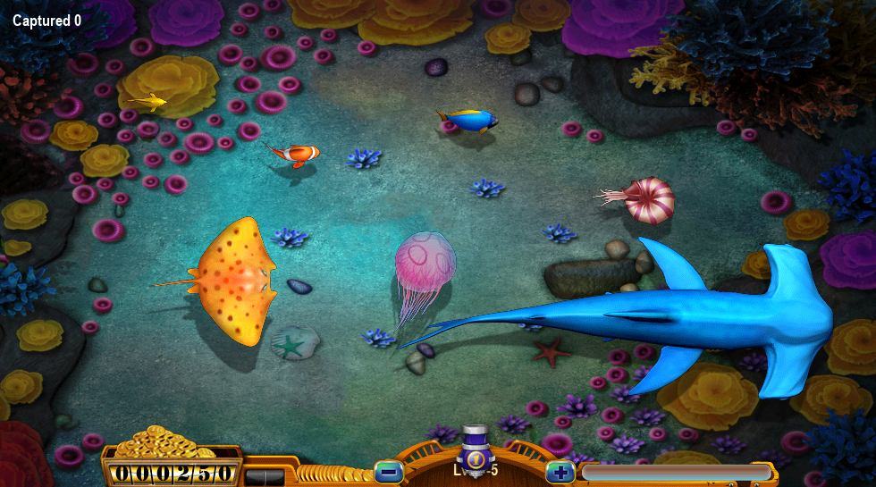
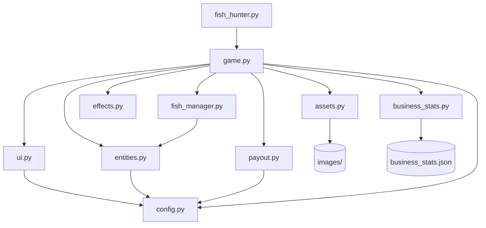

# Fish Hunter Python

Python/Pygame rewrite of the original `Fish Hunter_js` canvas game. This version keeps the original image assets, adds a machine-accounting setup screen, and separates the code into smaller modules for easier tuning.



## Features

- Pygame-based fish shooting gameplay
- Local image assets in `images/`
- Cannon levels with configurable shot cost
- Payout-rate controlled capture probability
- Fish capture animation with floating score and coin effects
- `F2` BIOS-style machine setup/accounting screen
- Five-day business stats stored in `business_stats.json`

## Run

```powershell
cd "Fish Hunter_python"
python -m pip install -r requirements.txt
python fish_hunter.py
```

## Controls

- Left click: fire
- `F1`: insert 50 coins
- `F2`: pause and open machine setup/accounting screen
- `+` / `=`: increase cannon power
- `-`: decrease cannon power
- `Esc`: quit

In the `F2` setup screen:

- `Left / Right`: adjust target payout rate between `60 / 70 / 80 / 90 / 96`
- `C`: clear today's machine accounting
- `R`: clear five-day business records
- `F2` or `Esc`: return to the game

## Program Structure

```text
Fish Hunter_python/
  fish_hunter.py        # Entry point
  game.py               # Main loop, input handling, update/draw orchestration
  config.py             # Constants, reward table, fish/cannon specs
  assets.py             # Image/font loading and rotation cache
  entities.py           # Fish, Bullet, Cannon
  fish_manager.py       # Fish spawning, pooling, spatial lookup
  effects.py            # Web, floating score, coin animations
  payout.py             # Payout rate and capture probability accounting
  business_stats.py     # Five-day business stats JSON storage
  ui.py                 # Bottom bar and F2 setup screen
  images/               # Local game assets
  docs/
    screenshot.png      # README screenshot
```

## Architecture Diagram



## Accounting Model

Only fired bullets count as machine input. Coins inserted with `F1` stay in the player's wallet until they are fired.

```text
machine input = total fired bullet cost
target payout = machine input * selected payout rate
available payout = target payout - paid out - pending awards
house hold estimate = machine input - paid out - pending awards
```

The payout controller uses this available payout budget together with each fish's base capture rate. Small fish remain easier to catch; big fish and sharks require more available payout budget because their rewards are higher.

## Tuning

Most gameplay values are in `config.py`:

- `PAYOUT_RATE_OPTIONS`: available F2 payout settings
- `CANNON_COSTS`: shot cost for cannon levels 1-7
- `REWARD_SCALE`: global fish reward multiplier
- `FISH_SPECS`: fish size, reward base, capture rate, group size, and speed

The game reads image assets from the local `images` folder beside `fish_hunter.py`.
